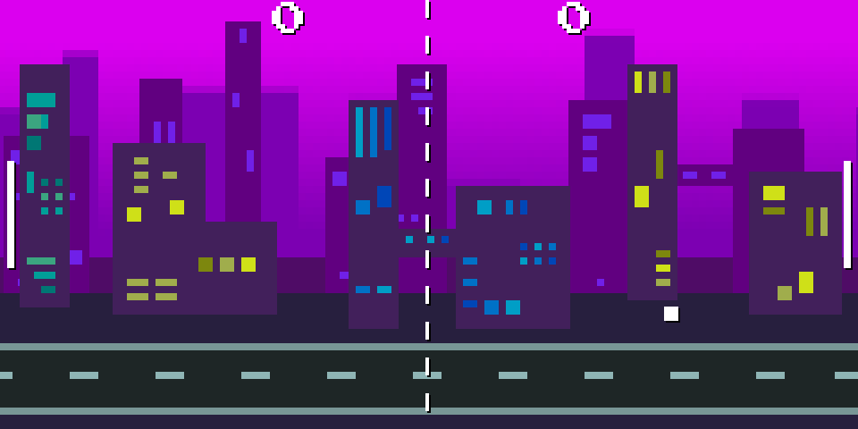

# Pong
This is a little Pong clone with a scrolling background I wrote in my launche breaks. 

## How to play
Use W and S key for the left side and arrow Up and Down for the right side. 
It is two player local only.

It's written in c++ with the [olc::PixelGameEngine](onelonecoder.com) for grafies and IO. It's a quick and handy tool.

Enjoy!
